# Asset-Manager: Deep Dive Stock OS - Complete Overview

## 📌 Executive Summary

**Deep Dive Stock OS** is a production-ready stock analysis web application that evaluates stocks using two independent trading horizons with market-aware adjustments. It provides professional-grade stock evaluation with scores (0-100), trade status labels, detailed breakdowns, and capital priority recommendations.

### Core Capabilities
- **Dual-Horizon Evaluation**: Strategic Growth (4-9 months) + Tactical Sentinel (0-4 months)
- **Market Context Awareness**: Real-time regime detection (RISK_ON / NEUTRAL / RISK_OFF)
- **Phase 2 Intelligence Engines**: Sector Regime, Portfolio Constraints, Relative Ranking
- **Multi-Provider Data Aggregation**: Finnhub, Financial Modeling Prep, Marketstack
- **Confidence Scoring**: Data quality assessment based on provider availability
- **Professional Dashboard**: React-based UI with stock cards and deep-dive analysis

---

## 🛠️ Technology Stack

### Frontend
| Technology | Version | Purpose |
|------------|---------|---------|
| React | 18.x | UI framework |
| TypeScript | 5.x | Type safety |
| Vite | 7.x | Build tool & dev server |
| TailwindCSS | 3.4 | Styling with semantic color tokens |
| TanStack Query | 5.x | Data fetching & caching |
| Wouter | - | Lightweight routing |
| Radix UI | - | Headless UI components |
| Recharts | - | Data visualization |
| Framer Motion | - | Animations |
| Lucide React | - | Icon library |

### Backend
| Technology | Version | Purpose |
|------------|---------|---------|
| Express | 5.x | HTTP server framework |
| Node.js | 20+ | JavaScript runtime |
| TypeScript | 5.x | Type safety |
| Drizzle ORM | - | Database ORM |
| Zod | - | Schema validation |

### Database & Caching
| Technology | Purpose |
|------------|---------|
| PostgreSQL | Primary database (via Neon/Supabase) |
| In-Memory Cache | TTL-based caching for API responses |

---

## 🔌 External APIs Used

| Provider | Endpoints | Data Types | Rate Limits |
|----------|-----------|------------|-------------|
| **Finnhub** | `/quote`, `/news-sentiment`, `/stock/insider-sentiment`, `/stock/option-chain` | Real-time quotes, sentiment analysis, institutional ownership, options chain, VIX data | 60 calls/min (free) |
| **Financial Modeling Prep (FMP)** | `/quote`, `/profile`, `/income-statement`, `/technical_indicator/sma` | Price quotes, company profiles, financial statements, 200-day SMA | 250 calls/day (free) |
| **Marketstack** | `/eod`, `/eod/latest` | Historical OHLC prices, end-of-day data | 100 calls/month (free) |

---

## 🏗️ Architecture Overview

```
┌─────────────────────────────────────────────────────────────────────────────┐
│                              CLIENT LAYER (React)                            │
│  ┌─────────────────┐  ┌───────────────────┐  ┌─────────────────────────┐   │
│  │    Dashboard    │  │   StockDeepDive   │  │   MarketContextPanel    │   │
│  │   (9 stocks)    │  │  (detailed eval)  │  │   (regime display)      │   │
│  └────────┬────────┘  └─────────┬─────────┘  └───────────┬─────────────┘   │
└───────────┼─────────────────────┼────────────────────────┼──────────────────┘
            │                     │                        │
            ▼                     ▼                        ▼
┌─────────────────────────────────────────────────────────────────────────────┐
│                           API LAYER (Express)                                │
│  ┌────────────────────────────────────────────────────────────────────────┐ │
│  │  GET /api/dashboard        → All stocks with evaluations               │ │
│  │  GET /api/stocks/:symbol   → Single stock deep dive                    │ │
│  │  GET /api/stocks/search    → Stock symbol search                       │ │
│  │  GET /api/market-context   → Market regime & indices                   │ │
│  │  GET /api/infra/health     → Provider health status                    │ │
│  │  GET /api/infra/logs       → Queryable log history                     │ │
│  └────────────────────────────────────────────────────────────────────────┘ │
└─────────────────────────────────────────────────────────────────────────────┘
            │
            ▼
┌─────────────────────────────────────────────────────────────────────────────┐
│                           DOMAIN LAYER                                       │
│  ┌─────────────────────┐  ┌─────────────────────┐  ┌─────────────────────┐  │
│  │  strategicGrowth    │  │  tacticalSentinel   │  │  marketContext      │  │
│  │    Evaluator        │  │    Evaluator        │  │    Engine           │  │
│  │  (4-9 month)        │  │  (0-4 month)        │  │  (regime detect)    │  │
│  └─────────────────────┘  └─────────────────────┘  └─────────────────────┘  │
│  ┌─────────────────────┐  ┌─────────────────────┐  ┌─────────────────────┐  │
│  │  sectorRegime       │  │  portfolio          │  │  ranking            │  │
│  │    Engine           │  │  Constraints        │  │    Engine           │  │
│  │  (FAVORED/AVOID)    │  │  (ALLOW/BLOCK)      │  │  (capital priority) │  │
│  └─────────────────────┘  └─────────────────────┘  └─────────────────────┘  │
│  ┌─────────────────────────────────────────────────────────────────────────┐│
│  │                     confidenceEvaluator                                 ││
│  │              (HIGH / MEDIUM / LOW data quality)                         ││
│  └─────────────────────────────────────────────────────────────────────────┘│
└─────────────────────────────────────────────────────────────────────────────┘
            │
            ▼
┌─────────────────────────────────────────────────────────────────────────────┐
│                          SERVICES LAYER                                      │
│  ┌─────────────────────────────────────────────────────────────────────────┐│
│  │  AGGREGATION: getStockSnapshot() → combines all provider data          ││
│  │  CACHE: TTL-based in-memory cache (configurable per data type)         ││
│  └─────────────────────────────────────────────────────────────────────────┘│
│  ┌─────────────────────────────────────────────────────────────────────────┐│
│  │  NORMALIZATION: normalizePrice, normalizeTechnicals, normalizeSentiment││
│  │  Transforms provider-specific responses to canonical types              ││
│  └─────────────────────────────────────────────────────────────────────────┘│
│  ┌─────────────────────────────────────────────────────────────────────────┐│
│  │  PROVIDERS:                                                             ││
│  │    finnhubProvider.ts  → quote, sentiment, institutional, options       ││
│  │    fmpProvider.ts      → price, financials, technicals                  ││
│  │    marketstackProvider.ts → historical prices (fallback)                ││
│  └─────────────────────────────────────────────────────────────────────────┘│
└─────────────────────────────────────────────────────────────────────────────┘
            │
            ▼
┌─────────────────────────────────────────────────────────────────────────────┐
│                        INFRASTRUCTURE LAYER                                  │
│  ┌─────────────────┐  ┌─────────────────┐  ┌─────────────────────────────┐  │
│  │ fetchWithRetry  │  │ providerGuard   │  │       logger                │  │
│  │ (retry+jitter)  │  │ (health mgmt)   │  │   (structured logging)      │  │
│  └─────────────────┘  └─────────────────┘  └─────────────────────────────┘  │
│  ┌─────────────────┐  ┌─────────────────┐                                   │
│  │ refreshManager  │  │   ttlPolicy     │                                   │
│  │  (scheduler)    │  │ (cache config)  │                                   │
│  └─────────────────┘  └─────────────────┘                                   │
└─────────────────────────────────────────────────────────────────────────────┘
```

---

## 📊 Data Flow Diagram


---

## 🧠 Domain Engine Deep Dive

### 1. Strategic Growth Anchor (4-9 Month Horizon)

**Purpose**: Evaluates stocks for medium-term investment suitability.

| Factor | Max Points | Description |
|--------|------------|-------------|
| Risk & Portfolio Guardrails | 15 | Position sizing, sector exposure limits |
| Macro Alignment | 10 | Fed policy, yield curve, economic cycle |
| Institutional Signals | 15 | Smart money flow, 13F filings, insider activity |
| Fundamental Acceleration | 20 | Revenue growth, margin expansion, guidance |
| Weekly Technical Structure | 15 | Trend, support/resistance, volume patterns |
| Time-Based Thesis Decay | 10 | Entry timing, catalyst proximity |
| **Raw Total** | **85** | Before regime adjustment |

**Regime Adjustments**:
- RISK_OFF: -12 points
- NEUTRAL: -4 points  
- RISK_ON: 0 points

**Status Thresholds**:
- **ELIGIBLE** (≥65): Ready for position entry
- **WATCH** (40-64): Monitor for improvement
- **REJECT** (<40): Do not enter

---

### 2. Tactical Sentinel (0-4 Month Horizon)

**Purpose**: Evaluates stocks for short-term trading opportunities.

| Factor | Max Points | Description |
|--------|------------|-------------|
| Multi-Timeframe Technical Alignment | 20 | Daily, weekly, monthly confluence |
| Momentum Regime | 15 | RSI, MACD, rate of change |
| Liquidity & Volume Triggers | 15 | Volume spikes, spread analysis |
| Sentiment & Options Context | 10 | Put/call ratio, social sentiment |
| Event Proximity | 15 | Earnings, FDA, economic releases |
| Time Stop Logic | 10 | Entry freshness, holding period |
| Opportunity Ranking | 15 | Relative strength vs. universe |
| **Total** | **100** | Full score range |

**Regime Adjustments**:
- RISK_ON: +8 points
- NEUTRAL: -3 points
- RISK_OFF: -12 points

**Status Thresholds**:
- **TRADE** (≥70): Active trading candidate
- **WATCH** (50-69): Monitor for setup
- **AVOID** (<50): No trade

---

### 3. Market Context Engine

**Purpose**: Determines overall market regime for adjustment application.

```mermaid
stateDiagram-v2
    [*] --> DataCollection
    
    DataCollection --> IndexAnalysis: Fetch SPY, QQQ, DIA, IWM
    IndexAnalysis --> BreadthAnalysis: Calculate trend scores
    BreadthAnalysis --> VIXAnalysis: Measure market breadth
    VIXAnalysis --> RegimeCalculation: Assess volatility
    
    RegimeCalculation --> RISK_ON: Score ≥ 60
    RegimeCalculation --> NEUTRAL: Score 40-59
    RegimeCalculation --> RISK_OFF: Score < 40
    
    RISK_ON --> [*]: Favorable conditions
    NEUTRAL --> [*]: Mixed signals
    RISK_OFF --> [*]: Defensive posture
```



**Inputs Analyzed**:
- **Major Indices**: SPY, QQQ, DIA, IWM price action
- **Market Breadth**: % of stocks above 200 DMA, advance/decline ratio
- **VIX Level**: Current level and 10-day trend
- **Sector Rotation**: Money flow between sectors

---

### 4. Sector Regime Engine (Phase 2)

**Purpose**: Evaluates sector-level conditions for capital allocation.


**Sectors Tracked**:
- Technology, Healthcare, Financials, Consumer Discretionary
- Consumer Staples, Energy, Industrials, Materials
- Utilities, Real Estate, Communication Services

---

### 5. Portfolio Constraint Engine (Phase 2)

**Purpose**: Enforces position sizing and exposure limits.


**Constraints Enforced**:
- Max single position: 10% of portfolio
- Max sector exposure: 30% of portfolio
- Correlation limit: Max 3 highly correlated positions
- Cash reserve: Minimum 5% cash buffer

---

### 6. Relative Ranking Engine (Phase 2)

**Purpose**: Prioritizes capital allocation across stock universe.


---

### 7. Confidence Evaluator

**Purpose**: Assesses data quality for evaluation reliability.


---

## 🔄 Provider Health State Machine


---

## 📈 Caching Strategy

| Data Type | TTL | Rationale |
|-----------|-----|-----------|
| Real-time Price | 60 seconds | Balance freshness vs. rate limits |
| Technical Indicators | 5 minutes | Slower-moving data |
| Fundamental Data | 6 hours | Rarely changes intraday |
| Sentiment Scores | 30 minutes | News-driven updates |
| Options Data | 15 minutes | Moderate update frequency |
| Historical OHLC | 1 hour | Static after market close |
| Full Stock Snapshot | 2 minutes | Aggregate cache |
| Market Context | 5 minutes | Regime changes slowly |

---

## 📂 Directory Structure Explained

```
asset-manager/
├── client/                      # React frontend application
│   ├── src/
│   │   ├── App.tsx             # Main app with routing
│   │   ├── main.tsx            # React entry point
│   │   ├── index.css           # Global styles + Tailwind
│   │   ├── components/
│   │   │   ├── layout/         # Header, navigation, layout
│   │   │   ├── market/         # Market context components
│   │   │   ├── stock/          # Stock cards, evaluation display
│   │   │   └── ui/             # Radix UI primitives
│   │   ├── hooks/              # Custom React hooks
│   │   ├── lib/                # Utilities, query client
│   │   └── pages/
│   │       ├── Dashboard.tsx   # Main dashboard view
│   │       └── StockDeepDive.tsx # Individual stock analysis
│   └── public/                 # Static assets
│
├── server/                      # Express backend
│   ├── index.ts                # Server entry point
│   ├── routes.ts               # API route definitions
│   ├── storage.ts              # In-memory storage
│   ├── domain/                 # Business logic engines
│   │   ├── confidence/         # Data quality assessment
│   │   ├── horizons/           # Evaluation engines
│   │   │   ├── strategicGrowth/
│   │   │   └── tacticalSentinel/
│   │   ├── marketContext/      # Regime detection
│   │   ├── portfolio/          # Constraint enforcement
│   │   ├── ranking/            # Capital priority
│   │   └── sectorRegime/       # Sector analysis
│   ├── infra/                  # Infrastructure utilities
│   │   ├── logging/            # Structured logging
│   │   ├── network/            # HTTP client, retries
│   │   └── scheduler/          # Background refresh
│   └── services/               # Data services
│       ├── aggregation/        # Data combination
│       ├── market/             # Market data service
│       ├── normalization/      # Data transformation
│       ├── providers/          # API integrations
│       └── stocks/             # Stock service
│
├── shared/                      # Shared types & constants
│   ├── schema.ts               # Drizzle DB schema
│   ├── constants/              # Thresholds, sector mappings
│   └── types/                  # TypeScript interfaces
│
├── attached_assets/            # Reference documentation
├── ideas/                      # Product roadmap docs
└── script/                     # Build scripts
```

---

## 🔑 Key Files Reference

### Server Core
| File | Purpose |
|------|---------|
| `server/index.ts` | Express app initialization |
| `server/routes.ts` | All API endpoint definitions |
| `server/storage.ts` | User storage (in-memory) |

### Domain Engines
| File | Purpose |
|------|---------|
| `server/domain/horizons/strategicGrowth/strategicGrowthEvaluator.ts` | 4-9 month evaluation |
| `server/domain/horizons/tacticalSentinel/tacticalSentinelEvaluator.ts` | 0-4 month evaluation |
| `server/domain/marketContext/marketContextEngine.ts` | Regime detection |
| `server/domain/confidence/confidenceEvaluator.ts` | Data quality scoring |
| `server/domain/sectorRegime/sectorRegimeEngine.ts` | Sector analysis |
| `server/domain/portfolio/portfolioConstraintEngine.ts` | Position constraints |
| `server/domain/ranking/relativeRankingEngine.ts` | Capital priority |

### Services
| File | Purpose |
|------|---------|
| `server/services/aggregation/stockSnapshot.ts` | Multi-provider data merge |
| `server/services/stocks/stockService.ts` | Stock evaluation orchestration |
| `server/services/providers/finnhubProvider.ts` | Finnhub API integration |
| `server/services/providers/fmpProvider.ts` | FMP API integration |
| `server/services/providers/marketstackProvider.ts` | Marketstack API integration |

### Shared Types
| File | Purpose |
|------|---------|
| `shared/types/stock.ts` | Stock data interfaces |
| `shared/types/evaluation.ts` | Evaluation result types |
| `shared/types/marketContext.ts` | Market regime types |
| `shared/types/horizon.ts` | Horizon-specific types |

---

## 📝 Evaluation Response Structure

```typescript
interface StockEvaluation {
  symbol: string;
  name: string;
  price: number;
  change: number;
  changePercent: number;
  
  strategicGrowth: {
    score: number;           // 0-100
    status: 'ELIGIBLE' | 'WATCH' | 'REJECT';
    factors: FactorBreakdown[];
    regimeAdjustment: number;
  };
  
  tacticalSentinel: {
    score: number;           // 0-100
    status: 'TRADE' | 'WATCH' | 'AVOID';
    factors: FactorBreakdown[];
    regimeAdjustment: number;
  };
  
  marketContext: {
    regime: 'RISK_ON' | 'NEUTRAL' | 'RISK_OFF';
    vix: number;
    breadth: number;
  };
  
  sectorRegime: {
    sector: string;
    status: 'FAVORED' | 'NEUTRAL' | 'AVOID';
    relativeStrength: number;
  };
  
  portfolioConstraint: {
    status: 'ALLOW' | 'REDUCE' | 'BLOCK';
    reason?: string;
  };
  
  capitalPriority: 'BUY' | 'ACCUMULATE' | 'PILOT' | 'WATCH' | 'BLOCKED';
  
  confidence: {
    level: 'HIGH' | 'MEDIUM' | 'LOW';
    providers: string[];
  };
  
  lastUpdated: string;
}
```

---

## 🚦 Stock Universe

Currently tracking 9 stocks (hardcoded):

| Symbol | Name | Sector |
|--------|------|--------|
| AAPL | Apple Inc. | Technology |
| MSFT | Microsoft Corporation | Technology |
| GOOGL | Alphabet Inc. | Technology |
| AMZN | Amazon.com Inc. | Consumer Discretionary |
| NVDA | NVIDIA Corporation | Technology |
| META | Meta Platforms Inc. | Technology |
| TSLA | Tesla Inc. | Consumer Discretionary |
| JPM | JPMorgan Chase & Co. | Financials |
| V | Visa Inc. | Financials |

---

## 🔧 Configuration Files

| File | Purpose |
|------|---------|
| `package.json` | Dependencies, scripts |
| `tsconfig.json` | TypeScript configuration |
| `vite.config.ts` | Vite build configuration |
| `tailwind.config.ts` | Tailwind CSS theming |
| `drizzle.config.ts` | Database ORM configuration |
| `components.json` | Shadcn/UI component settings |

---

*Document Version: 1.0*  
*Last Updated: February 2026*
